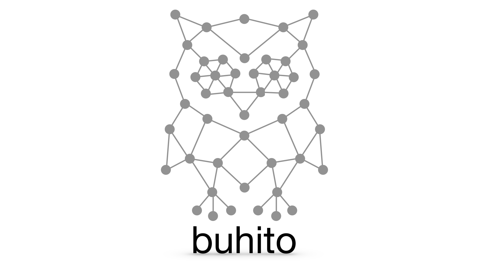

# Buhito



**Buhito** is a Python toolkit for graphlet enumeration, graphlet feature
extraction, reversible motif tokenization, and minimum-description-length
(MDL) analysis of graph datasets.

The central workflow is:

1. enumerate repeated connected induced graphlets;
2. learn a motif dictionary from a fitting corpus;
3. contract node-disjoint motif occurrences into reversible supernodes;
4. account for the complete description length of the dictionary, rewritten
   graphs, boundary ports, selectors, and model choice;
5. apply the frozen dictionary to held-out graphs;
6. compare storage, graph size, graphlet runtime, memory, and downstream GNN
   runtime on the original and tokenized representations.

Buhito is intentionally model-agnostic. Its graph outputs are ordinary
NetworkX graphs that can be adapted to graph kernels, GNNs, databases, graph
algorithms, or custom scientific pipelines.

> **Important:** analytical MDL savings, serialized file size, graph-size
> reduction, and downstream runtime savings are different quantities. Buhito
> reports them separately. A tokenized graph may have negative MDL savings but
> still run faster in a downstream workload because it contains fewer nodes and
> edges.

---

## Contents

- [What Buhito provides](#what-buhito-provides)
- [What Buhito does not claim](#what-buhito-does-not-claim)
- [Installation](#installation)
- [Quick start](#quick-start)
- [Graph schemas and lossless scope](#graph-schemas-and-lossless-scope)
- [Graphlet enumeration](#graphlet-enumeration)
- [MDL compression and motif tokenization](#mdl-compression-and-motif-tokenization)
- [Understanding the accounting](#understanding-the-accounting)
- [Human-readable motif analysis](#human-readable-motif-analysis)
- [TU dataset workflows](#tu-dataset-workflows)
- [Raw-versus-tokenized runtime benchmark](#raw-versus-tokenized-runtime-benchmark)
- [Downstream GNN timing](#downstream-gnn-timing)
- [Compression--speed--quality Pareto sweeps](#compression--speed--quality-pareto-sweeps)
- [HPC and SLURM execution](#hpc-and-slurm-execution)
- [Output files and metrics](#output-files-and-metrics)
- [Interpreting common outcomes](#interpreting-common-outcomes)
- [Reproducibility checklist](#reproducibility-checklist)
- [Troubleshooting](#troubleshooting)
- [Development and testing](#development-and-testing)
- [Citation and license](#citation-and-license)

---

## What Buhito provides

Buhito currently provides four related capabilities.

### 1. Graphlet enumeration

The original breadth-first and depth-first graphlet APIs remain available:

```python
from buhito import generate_subgraphs_breadthwise
from buhito import generate_subgraphs_depthwise
```

### 2. Reversible MDL motif tokenization

`MDLGraphCompressor` learns a frozen motif dictionary on fitting graphs,
contracts node-disjoint motif occurrences, and records the information required
to recover the coded topology and selected labels exactly.

### 3. Scientific diagnostics

The analysis layer reports:

- every candidate motif considered;
- forced single-candidate cost and savings;
- the complete dictionary-prefix path, including the empty dictionary;
- selected versus rejected candidates;
- topology names and label patterns;
- JSON, GraphML, PNG, and SVG motif assets;
- exact cost decomposition;
- decoding failures, which should always be zero.

### 4. Systems benchmarks

The benchmark layer compares original and tokenized representations for:

- graphlet-enumeration wall time;
- process peak resident memory;
- Python heap peak;
- node and edge reduction;
- one-time dictionary fitting and transformation cost;
- amortization and break-even reuse;
- a built-in structural GCN inference or training workload;
- local serial, bounded local parallel, and SLURM-array execution.

---

## What Buhito does not claim

Buhito does **not** assume that every recurring motif compresses a dataset.
The empty dictionary is a valid and often correct result.

Buhito also does not claim that:

- fewer nodes automatically imply a smaller complete MDL code;
- a tokenized graph has the same graphlet counts as the original graph;
- a GNN run on a tokenized graph has identical predictions to the same GNN run
  on the original graph;
- negative MDL savings imply that tokenization has no computational value;
- positive runtime speedup alone establishes predictive equivalence.

For downstream ML experiments, report both computational metrics and task
quality metrics on a proper train/validation/test split.

---

## Installation

Buhito requires Python 3.10 or newer.

### Editable research installation

```bash
# Replace <repository-url> with the appropriate GitLab or GitHub remote.
git clone <repository-url> buhito
cd buhito

python -m pip install -e .
```

### Tests and developer tools

```bash
python -m pip install -e ".[tests]"
```

### Visualization

```bash
python -m pip install -e ".[viz]"
```

### Optional GNN benchmark

The reference GCN uses PyTorch but does not require PyTorch Geometric:

```bash
python -m pip install -e ".[gnn]"
```

This separation keeps the base graph-compression package lightweight and avoids
forcing a particular GNN framework onto users.

### Other optional groups

```bash
python -m pip install -e ".[chem]"       # RDKit functionality
python -m pip install -e ".[notebooks]"  # Jupyter and plotting
python -m pip install -e ".[dev]"        # development environment
```

Confirm that Python imports the checkout you intend to modify:

```bash
python - <<'PY'
import buhito
import buhito.mdl

print("Buhito:", buhito.__file__)
print("MDL:", buhito.mdl.__file__)
PY
```

---

## Quick start

### Fit and apply a reversible motif dictionary

```python
import networkx as nx

from buhito import ExhaustiveGraphletEnumerator, MDLGraphCompressor


def triangles(count: int) -> nx.Graph:
    graph = nx.Graph()
    for index in range(count):
        first = 3 * index
        graph.add_edges_from(
            [
                (first, first + 1),
                (first + 1, first + 2),
                (first + 2, first),
            ]
        )
    return graph


fit_graphs = [triangles(4), triangles(5), triangles(6)]
eval_graphs = [triangles(3), triangles(7)]

compressor = MDLGraphCompressor(
    graphlet_sizes=(3,),
    n_rules=2,
    min_graph_support=1,
    min_occurrences=1,
    max_candidates=10,
    node_label_keys=None,
    edge_label_keys=None,
    selector="sparse",
    enumerator=ExhaustiveGraphletEnumerator(),
    validate=True,
)

compressor.fit(fit_graphs)
result = compressor.transform(eval_graphs)

print(result.report)
print(compressor.candidate_frame())
print(compressor.dictionary_path_frame())

model_graphs = result.model_graphs()
decoded_graphs = result.decoded_graphs()
```

`model_graphs` contains the representation selected by the complete MDL
objective. `decoded_graphs` contains reconstructed graphs.

### Inspect candidate motifs as NetworkX graphs

```python
motifs = compressor.candidate_motif_graphs()

for key, motif in motifs.items():
    print(key, motif.number_of_nodes(), motif.number_of_edges())
```

The returned graphs are independent copies; modifying them does not mutate the
fitted compressor.

---

## Graph schemas and lossless scope

A `GraphSchema` defines which node and edge attributes enter the code.

```python
from buhito import GraphSchema

schema = GraphSchema.from_keys(
    node_label_keys=("atom", "formal_charge"),
    edge_label_keys="bond",
)
```

Or pass the keys directly to `MDLGraphCompressor`:

```python
compressor = MDLGraphCompressor(
    node_label_keys=("atom", "formal_charge"),
    edge_label_keys="bond",
)
```

### What is preserved

Buhito's lossless guarantee covers:

- undirected simple topology;
- the node attributes selected by `node_label_keys`;
- the edge attributes selected by `edge_label_keys`;
- graph metadata used by the normalized representation;
- all boundary-port information required to expand motif supernodes.

### What is not automatically part of the code

The following remain outside the MDL code unless explicitly encoded:

- graph-level targets;
- coordinates;
- timestamps;
- arbitrary unselected node or edge attributes;
- original user node identifiers.

Keep targets and uncoded scientific metadata in the surrounding dataset object.
Do not copy graph-class labels onto every node merely to make them visible to
the compressor.

### Topology-only graphs

Use `None` for both label-key arguments:

```python
compressor = MDLGraphCompressor(
    node_label_keys=None,
    edge_label_keys=None,
)
```

Topology-only mode is appropriate for datasets such as REDDIT-MULTI-5K when no
discrete node or edge label files are present.

---

## Graphlet enumeration

### Breadth-first enumeration

```python
import networkx as nx
from buhito import generate_subgraphs_breadthwise

G = nx.petersen_graph()
nx.set_node_attributes(G, "C", "atom_key")
nx.set_edge_attributes(G, "1", "bond_key")

fingerprint, bitinfo = generate_subgraphs_breadthwise(
    G,
    depth=4,
    return_nodewise=False,
    full_hash=True,
    node_key="atom_key",
    edge_key="bond_key",
)
```

### Depth-first enumeration

```python
from buhito import generate_subgraphs_depthwise

subsets, counts = generate_subgraphs_depthwise(G, maxlen=4)
```

### Enumeration backends used by MDL

```python
from buhito import BuhitoGraphletEnumerator
from buhito import ExhaustiveGraphletEnumerator
```

- `BuhitoGraphletEnumerator` uses the package graphlet implementation.
- `ExhaustiveGraphletEnumerator` is useful for small graphs, diagnostics, and
  cross-checking.

The compressor freezes motif identity after fitting. Held-out transformation
does not relearn or rerank the dictionary.

---

## MDL compression and motif tokenization

### Core estimator

```python
from buhito import MDLGraphCompressor

compressor = MDLGraphCompressor(
    graphlet_sizes=(3,),
    n_rules=5,
    min_graph_support=2,
    min_occurrences=3,
    max_candidates=50,
    selector="sparse",
    model_choice_bits=1.0,
    dictionary_selection="best",
    validate=True,
)
```

Important parameters:

| Parameter | Meaning |
|---|---|
| `graphlet_sizes` | Connected induced motif sizes considered. |
| `n_rules` | Maximum dictionary size. |
| `min_graph_support` | Minimum number of fitting graphs containing the candidate. |
| `min_occurrences` | Minimum total fitting-corpus occurrence count. |
| `max_candidates` | Maximum candidates retained for full scoring. |
| `selector` | Non-overlap selection strategy. |
| `model_choice_bits` | Cost of signaling the baseline versus rewritten model. |
| `min_rule_savings_bits` | Candidate gate for dictionary selection. |
| `dictionary_selection` | Choose the best prefix or force a fixed prefix. |
| `validate` | Verify every rewrite reconstructs exactly. Keep this enabled. |
| `cache_dir` | Optional occurrence-cache directory. |

### Selected mode

Selected mode uses only a dictionary prefix accepted by the complete MDL
objective:

```python
compressor = MDLGraphCompressor(
    dictionary_selection="best",
    min_rule_savings_bits=0.0,
)
```

The empty dictionary is legal. If it wins, `n_rules=0` is the correct result,
not an error.

### Forced mode

Forced mode is useful for diagnostics and computational experiments:

```python
import math

compressor = MDLGraphCompressor(
    dictionary_selection="fixed",
    min_rule_savings_bits=-math.inf,
)
```

A forced rewrite can reduce nodes while increasing the complete MDL code.
Always label this as **forced tokenization**, not successful compression.

### Exact validation

Buhito validates rewrites using the stored occurrence witness and original
normalized host-node identifiers. The hot path compares exact nodes, edges,
labels, and metadata in linear time rather than invoking a generic graph
isomorphism search.

Keep `validate=True` in scientific runs.

---

## Understanding the accounting

Buhito reports analytical codelengths in bits. These are not the byte length of
a pickle, GraphML file, Parquet table, or compressed archive.

The complete encoded cost contains conceptually distinct terms:

- baseline or passthrough graph cost;
- motif dictionary cost;
- rewritten template cost;
- boundary-port cost;
- selector cost;
- model-choice cost.

The principal quantity is:

```text
net_savings_bits = baseline_bits - encoded_bits
```

Positive values improve the complete analytical code. Negative values do not.

### Why the empty dictionary may report `-1`

When `model_choice_bits=1`, the empty model can have:

```text
dictionary_bits = 0
rewrite_bits = 0
model_choice_bits = 1
net_savings_bits = -1
```

This means motif compression gained zero bits while the complete protocol paid
one model-choice bit. It is not a meaningful degradation of the graph.

### Forced candidate accounting

`candidate_frame()` distinguishes:

- `forced_net_savings_bits`: cost when the candidate is actually used as a
  nonempty rule;
- `best_model_net_savings_bits`: best result when the empty baseline remains an
  allowed alternative.

This distinction prevents every harmful candidate from incorrectly inheriting
the same empty-model score.

### Dictionary path

`dictionary_path_frame()` retains every evaluated prefix, including harmful
ones:

```python
path = compressor.dictionary_path_frame()
print(path[["n_rules", "encoded_bits", "net_savings_bits", "is_best"]])
```

A typical path may show dictionary sizes `0, 1, 2, 3`, with the zero-rule row
marked as best.

---

## Human-readable motif analysis

The analysis package converts opaque canonical keys into interpretable motif
records.

```python
from buhito.analysis import run_mdl_analysis
```

Depending on the workflow, generated tables include:

- stable run-local IDs such as `M001`;
- topology names such as `path-P3`, `triangle`, or `cycle-C4`;
- degree sequence and density;
- node-label pattern;
- edge-label pattern;
- graph support and total occurrences;
- selected status;
- forced cost decomposition;
- human-readable edge lists.

### Topology family versus labeled motif

Two motifs can share the same unlabeled topology while remaining distinct
lossless rules.

For example, several candidates may all be `path-P3`, yet differ in:

- node labels;
- edge labels;
- placement of labels relative to the center and endpoints.

Node numbering and drawing orientation do not define motif identity. Label-aware
isomorphism does.

### Typical artifact directory

```text
motifs.csv
motif_costs.csv
motif_assets.csv
dictionary_path.csv
summary.json
motif_cost_decomposition.png
support_vs_savings.png
motif_assets/M001_*.json
motif_assets/M001_*.graphml
motif_assets/M001_*.png
motif_assets/M001_*.svg
```

---

## TU dataset workflows

Buhito includes a lightweight TU text-format loader and does not require
PyTorch Geometric.

```python
from buhito.datasets import load_tu_dataset

dataset = load_tu_dataset(
    "/path/to/TUDataset",
    "REDDIT-MULTI-5K",
    node_label_mode="auto",
    edge_label_mode="auto",
)

print(len(dataset.graphs))
print(dataset.graph_labels)
print(dataset.node_label_key)
print(dataset.edge_label_key)
```

Supported layouts include:

```text
TUDataset/DATASET/<TU files>
TUDataset/DATASET/raw/<TU files>
a nested cache containing DATASET_A.txt
```

### Motif-analysis example

```bash
python examples/mdl_analyze_tu.py \
  --data-root "$TU_ROOT" \
  --dataset MUTAG \
  --node-label-mode auto \
  --edge-label-mode auto \
  --graphlet-sizes 3 \
  --fit-size 40 \
  --eval-size 20 \
  --n-rules 3 \
  --min-graph-support 2 \
  --min-occurrences 3 \
  --max-candidates 10 \
  --bootstrap 100 \
  --cache-dir artifacts/mdl_cache/mutag \
  --output-dir artifacts/mdl_analysis/mutag \
  --plots
```

---

## Raw-versus-tokenized runtime benchmark

`examples/benchmark_reddit_tokenization.py` measures graphlet enumeration on
the original and tokenized evaluation graphs.

It reports:

- median enumeration time and interquartile range;
- process peak RSS;
- Python heap peak;
- total nodes and edges;
- graphlet occurrences and unique keys;
- compression fit and transform time;
- node and edge reduction;
- enumeration speedup;
- first-pass cost;
- break-even reuse count;
- exact decode failures.

### Preview before computing

Always preview a large dataset sample before enumeration:

```bash
python examples/benchmark_reddit_tokenization.py \
  --data-root "$TU_ROOT" \
  --dataset REDDIT-MULTI-5K \
  --node-label-mode auto \
  --edge-label-mode auto \
  --smoke \
  --mode forced \
  --print-sample-only \
  --output-dir artifacts/runtime/reddit_preview
```

Preview mode loads, filters, samples, prints, and saves the manifest. It does
not fit a compressor or launch a worker.

### Safety caps

Large hubs can dominate size-three graphlet enumeration because the wedge proxy
scales as:

```text
sum over vertices of degree(v) choose 2
```

Use:

```text
--max-nodes
--max-edges
--max-degree
--max-wedges
```

A safe smoke preset resolves to approximately:

```text
fit_size               2
eval_size              2
size_bins              1
max_nodes              500
max_edges              750
max_degree             200
max_wedges             50000
n_rules                1
max_candidates         2
repeats                1
warmup_repeats         0
threads                1
phase_timeout_seconds  600
```

Explicit command-line values override preset defaults.

### Safe smoke run

```bash
python examples/benchmark_reddit_tokenization.py \
  --data-root "$TU_ROOT" \
  --dataset REDDIT-MULTI-5K \
  --node-label-mode auto \
  --edge-label-mode auto \
  --smoke \
  --mode forced \
  --backend buhito \
  --compressor-backend buhito \
  --token-projection simple \
  --jobs 1 \
  --cache-dir artifacts/runtime/cache/reddit_smoke \
  --output-dir artifacts/runtime/reddit_smoke_forced
```

For clean local timing, use `--jobs 1 --threads 1`. Local parallelism improves
throughput but can introduce CPU-cache and memory-bandwidth contention.

### Selected versus forced controls

Run both:

```text
--mode selected
--mode forced
```

Selected mode answers whether the actual MDL-optimal representation accelerates
the workload. Forced mode asks whether structural contraction is
computationally useful even when the storage code is larger.

---

## Downstream GNN timing

### Did the graphlet runtime benchmark already measure a GNN?

No. The graphlet benchmark measures Buhito enumeration on original and
tokenized graphs. The downstream GNN benchmark is a separate layer.

`examples/benchmark_gnn_tokenization.py` consumes an immutable prepared runtime
state and measures a reference structural GCN on the same original and
tokenized evaluation graphs.

The reference implementation:

- uses optional PyTorch;
- does not require PyTorch Geometric;
- uses the same architecture and feature width for both representations;
- uses fixed structural features: constant, log degree, normalized degree,
  motif-node indicator, and motif-rule rank;
- supports inference and optimizer-step timing;
- synchronizes CUDA before reading timers;
- reports CPU peak RSS and CUDA peak allocated memory;
- supports isolated repeats, local jobs, and SLURM arrays.

### Interpretation boundary

The built-in GCN is a **systems reference**. Tokenization changes the graph on
which message passing occurs. A speedup does not prove equivalent predictions.

For a scientific GNN study:

1. use the same data split and labels;
2. use equivalent architecture and optimization settings;
3. report runtime and memory;
4. report validation/test quality;
5. report the change in quality together with speedup;
6. distinguish inference speedup from training speedup;
7. report the one-time compression cost and break-even reuse.

### Prepare a runtime state first

The GNN benchmark reuses the original/tokenized payloads produced by the runtime
benchmark:

```text
artifacts/runtime/reddit_smoke_forced/prepared/
```

### Install the optional dependency

```bash
python -m pip install -e ".[gnn]"
```

### GNN inference smoke run

```bash
python examples/benchmark_gnn_tokenization.py \
  --runtime-prepared-dir \
    artifacts/runtime/reddit_smoke_forced/prepared \
  --output-dir artifacts/gnn/reddit_smoke_inference \
  --gnn-mode inference \
  --device auto \
  --smoke \
  --jobs 1
```

This writes:

```text
gnn_runs.csv
gnn_summary.csv
summary.json
metadata.json
compression_summary.json
README.md
prepared/task_manifest.csv
prepared/task_results/task_*.json
```

### Training-kernel timing

Training mode requires graph labels so the prepared evaluation indices can be
matched to the TU dataset:

```bash
python examples/benchmark_gnn_tokenization.py \
  --runtime-prepared-dir \
    artifacts/runtime/reddit_smoke_forced/prepared \
  --data-root "$TU_ROOT" \
  --dataset REDDIT-MULTI-5K \
  --output-dir artifacts/gnn/reddit_smoke_training \
  --gnn-mode training \
  --device auto \
  --epochs 10 \
  --repeats 5 \
  --jobs 1
```

This mode uses a deterministic paired split of the prepared graphs. The same
training and held-out evaluation indices are used for the original and
tokenized representations. Separate models with the same architecture, seed,
and optimization settings are trained for each representation.

The timed region contains forward, backward, and optimizer steps on the
training split. Held-out evaluation runs after the timer and reports loss,
accuracy, and macro-F1. Control the held-out fraction with:

```bash
--quality-eval-fraction 0.2
```

A smoke run may contain only one held-out graph. Its quality metrics verify that
the pipeline works but are not statistically meaningful. Use a substantially
larger paired sample and multiple seeds for a scientific quality comparison.

### Headline GNN statistics

The summary reports:

```text
raw_median_workload_seconds
tokenized_median_workload_seconds
gnn_speedup
gnn_time_saved_seconds_per_repeat
compression_total_seconds
first_tokenized_pass_total_seconds
gnn_break_even_reuses
raw_median_peak_rss_mb
tokenized_median_peak_rss_mb
raw_median_cuda_peak_memory_mb
tokenized_median_cuda_peak_memory_mb
node_reduction_fraction
edge_reduction_fraction
mdl_net_savings_bits
quality_metrics_available
quality_metrics_reason
train_graph_count
quality_eval_graph_count
raw_median_quality_eval_loss
tokenized_median_quality_eval_loss
quality_eval_loss_delta
raw_median_quality_eval_accuracy
tokenized_median_quality_eval_accuracy
quality_eval_accuracy_delta
raw_median_quality_eval_macro_f1
tokenized_median_quality_eval_macro_f1
quality_eval_macro_f1_delta
```

The key computational tradeoff is:

```text
time_saved_per_use = raw_workload_time - tokenized_workload_time

break_even_reuses = compression_time / time_saved_per_use
```

If tokenized execution is not faster, break-even is infinite.


### Why inference accuracy is `null`

Inference mode times an untrained systems-reference network. Reporting its
accuracy would be misleading, even when labels are available. Therefore:

```json
{
  "quality_metrics_available": false,
  "raw_median_accuracy": null,
  "tokenized_median_accuracy": null,
  "accuracy_delta": null
}
```

Buhito writes strict JSON and never emits non-standard `NaN` tokens. Use
training mode with graph labels to obtain held-out predictive quality.

### Use the tradeoff statistics with a custom GNN

Practitioners can time their own model and use the framework-neutral helper:

```python
from buhito.benchmarks import workload_tradeoff_summary

summary = workload_tradeoff_summary(
    original_seconds=12.4,
    tokenized_seconds=7.1,
    compression_seconds=45.0,
)

print(summary)
```

Use median times from the same number of isolated repeats on the same hardware.
Do not compare a warm original run against a cold tokenized run.

### Access the prepared graphs for a custom framework

The runtime prepared directory contains ordinary pickled NetworkX graph lists:

```python
import pickle
from pathlib import Path

prepared = Path("artifacts/runtime/reddit_smoke_forced/prepared")

with (prepared / "original_payload.pkl").open("rb") as handle:
    original = pickle.load(handle)["graphs"]

with (prepared / "tokenized_payload.pkl").open("rb") as handle:
    tokenized = pickle.load(handle)["graphs"]
```

Use these exact paired lists when adapting a custom PyG, DGL, JAX, TensorFlow,
or domain-specific model.

---

## Compression--speed--quality Pareto sweeps

A single forced-tokenization result does not reveal whether fewer rules would
retain most of the speedup with less predictive degradation. Buhito therefore
provides a nested rule-prefix sweep through:

```text
examples/benchmark_gnn_pareto.py
```

The sweep is designed for paper-quality comparisons. It enforces the following
controls:

- one deterministic fit/evaluation graph sample;
- one dictionary fit at the largest requested rule count;
- nested prefixes from the same ranked candidate list;
- one shared original-graph GNN baseline per seed;
- the same train/held-out split for every prefix;
- the same architecture, optimizer, epochs, and paired model seeds;
- isolated measurement processes;
- atomic local or SLURM task results;
- exact decode validation for every prefix;
- strict JSON and explicit missing metrics;
- paired uncertainty and significance summaries.

### Why the dictionary is fitted once

Running separate compression jobs for `k=1`, `k=2`, and `k=3` can change the
candidate pool, duplicate an expensive fit, and make preparation costs hard to
interpret. The Pareto implementation instead fits once at the maximum requested
prefix and materializes:

```text
k = 0: original graph baseline
k = 1: top-ranked motif rule
k = 2: first two ranked motif rules
k = 3: first three ranked motif rules
```

A requested prefix must exist. Topology-only size-three Reddit graphs often
produce only two candidate families, so the practical sweep is commonly
`0,1,2`. Requesting `k=3` raises a clear error when only two candidates were
scored.

The fitted estimator is not mutated when a prefix is transformed. Prefixes use
`MDLGraphCompressor.rule_prefix()` and
`MDLGraphCompressor.transform_rule_prefix()`.

### Prepare and run a Reddit sweep

Reuse the exact sample from an existing runtime prepared state. This keeps the
Pareto study aligned with the earlier systems experiment:

```bash
export TU_ROOT="/Users/mmontes/Datasets/TUDataset"

python examples/benchmark_gnn_pareto.py \
  --reference-runtime-prepared-dir \
    artifacts/runtime/reddit5k_gnn_pilot/prepared \
  --data-root "$TU_ROOT" \
  --dataset REDDIT-MULTI-5K \
  --rule-counts 0,1,2 \
  --gnn-mode training \
  --epochs 200 \
  --repeats 5 \
  --warmup-steps 2 \
  --hidden-channels 64 \
  --num-layers 3 \
  --batch-size 16 \
  --quality-eval-fraction 0.2 \
  --learning-rate 0.001 \
  --weight-decay 0.0001 \
  --bootstrap-samples 5000 \
  --confidence-level 0.95 \
  --accuracy-drop-tolerance 0.02 \
  --macro-f1-drop-tolerance 0.02 \
  --jobs 1 \
  --phase-timeout-seconds 1800 \
  --output-dir artifacts/gnn/reddit5k_pareto \
  --plots
```

Use `--jobs 1` for the cleanest local timing. Use local parallelism or a SLURM
array for throughput, while interpreting each isolated task's own time as the
measurement.

For a resumable staged local workflow, prepare once, run the immutable task
manifest, and aggregate separately:

```bash
python examples/benchmark_gnn_pareto.py \
  --reference-runtime-prepared-dir \
    artifacts/runtime/reddit5k_gnn_pilot/prepared \
  --data-root "$TU_ROOT" \
  --dataset REDDIT-MULTI-5K \
  --rule-counts 0,1,2 \
  --epochs 200 \
  --repeats 5 \
  --prepared-dir artifacts/gnn/reddit5k_pareto/prepared \
  --output-dir artifacts/gnn/reddit5k_pareto \
  --prepare-only

python examples/benchmark_gnn_pareto.py \
  --prepared-dir artifacts/gnn/reddit5k_pareto/prepared \
  --run-tasks-only \
  --jobs 1

python examples/benchmark_gnn_pareto.py \
  --prepared-dir artifacts/gnn/reddit5k_pareto/prepared \
  --aggregate-only \
  --output-dir artifacts/gnn/reddit5k_pareto \
  --plots
```

### Prepare, submit, and aggregate on an HPC

Preparation fits and validates the dictionary once and creates immutable GNN
payloads:

```bash
python examples/benchmark_gnn_pareto.py \
  --reference-runtime-prepared-dir \
    artifacts/runtime/reddit5k_gnn_pilot/prepared \
  --data-root "$TU_ROOT" \
  --dataset REDDIT-MULTI-5K \
  --rule-counts 0,1,2 \
  --epochs 200 \
  --repeats 10 \
  --prepared-dir artifacts/gnn/reddit5k_pareto_hpc/prepared \
  --output-dir artifacts/gnn/reddit5k_pareto_hpc \
  --prepare-only \
  --write-slurm-script \
    artifacts/gnn/reddit5k_pareto_hpc/submit_array.slurm
```

Edit site placeholders in the generated script, submit it, and aggregate after
all array tasks finish:

```bash
sbatch artifacts/gnn/reddit5k_pareto_hpc/submit_array.slurm

python examples/benchmark_gnn_pareto.py \
  --prepared-dir artifacts/gnn/reddit5k_pareto_hpc/prepared \
  --aggregate-only \
  --output-dir artifacts/gnn/reddit5k_pareto_hpc \
  --plots
```

The global task manifest contains one original task per seed and one tokenized
task per positive rule count and seed. The original baseline is not retrained
redundantly for each prefix.

### Statistical summaries

For each rule count, Buhito reports:

```text
median paired speedup
median time-reduction fraction
number of paired repeats that were faster
one-sided exact sign-test p-value
bootstrap interval for median paired speedup
bootstrap interval for median accuracy delta
bootstrap interval for median macro-F1 delta
bootstrap interval for median held-out loss delta
```

The exact sign test asks whether positive timing differences occur more often
than expected under a 50/50 null. For five wins in five paired repeats, the
one-sided p-value is `0.03125`. With very few seeds, bootstrap intervals are
descriptive and should not be treated as definitive population intervals.

Quality tolerances are evaluated as formal non-inferiority margins. For an
accuracy margin `delta_acc`, Buhito declares a prefix accuracy-noninferior only
when the configured one-sided bootstrap lower confidence bound satisfies:

```text
accuracy_delta_lower_bound >= -delta_acc
```

The same rule is applied to macro-F1, and a prefix receives
`quality_noninferior=True` only when both criteria pass. The old median-only
check remains available as `median_quality_within_tolerance` for diagnosis, but
it is not used to recommend a deployment point. Exact one-sided sign tests of
the shifted paired differences are reported as supplementary evidence. Margins
must be chosen before inspecting the tested prefix results.

### Pareto-front definition

A point is nondominated in speed/quality space when no other tested prefix has:

1. at least as large a median paired speedup;
2. at least as good a held-out quality delta; and
3. a strict improvement in at least one of those two quantities.

Buhito reports separate frontiers using accuracy and macro-F1. It also flags the
fastest point whose one-sided confidence bounds establish non-inferiority for
both user-specified accuracy and macro-F1 margins. A point-estimate-only
tolerance flag is retained for diagnosis but is not used for recommendation.

### Storage and preparation accounting

Each positive prefix reports both:

```text
forced_net_savings_bits
best_model_net_savings_bits
```

`forced_net_savings_bits` measures the representation actually used in the
computational experiment. `best_model_net_savings_bits` allows the selector to
fall back to the better corpus code. These fields must not be conflated.

Preparation time is split into:

```text
shared_dictionary_fit_seconds
incremental_transform_seconds
diagnostic_accounting_seconds
standalone_preparation_seconds
```

The paper-facing break-even count uses `standalone_preparation_seconds` divided
by the median time saved per complete downstream workload. The dictionary fit
is shared across the sweep but is included when asking whether a chosen prefix
would amortize as a deployed preprocessing step.

### Pareto output bundle

A completed sweep writes:

```text
pareto_points.csv
pareto_paired_runs.csv
pareto_statistics.csv
pareto_frontier.csv
pareto_per_class_metrics.csv
pareto_confusion_matrices.csv
compression_prefixes.csv
graph_sizes_by_prefix.csv
paper_table.csv
paper_table.md
paper_table.tex
summary.json
metadata.json
README.md
pareto_speed_accuracy.png
pareto_reduction_speed.png
```

Validate it with:

```bash
python examples/validate_gnn_pareto.py \
  artifacts/gnn/reddit5k_pareto \
  --require-plots
```

The validator checks strict JSON, prefix counts, exact decode success, baseline
identity, shared original timings, equal repeat counts, finite headline
statistics, and paper artifact completeness. Per-class and confusion-matrix
artifacts make majority-class collapse visible instead of hiding it behind a
single accuracy number.

### Reporting a Pareto result

A complete statement should include all of the following:

> The `k=2` forced motif prefix reduced nodes by 28.2% and edges by 26.6%,
> accelerated the paired 200-epoch training workload by 1.39x, changed held-out
> accuracy by -0.05 and macro-F1 by -0.033, had negative forced MDL savings,
> and required approximately 182 repeated workloads to amortize its standalone
> preparation cost.

Do not report speedup without held-out quality. Do not call a forced point
"compression" when its complete MDL code is larger.

### CI coverage for GNN and Pareto machinery

GitLab CI includes a dedicated `gnn-pareto-cpu` job that installs
`.[tests,gnn]` and runs the end-to-end GNN and Pareto regression suites with
thread counts fixed to one. The ordinary Python-version jobs remain lightweight
and may skip Torch-dependent worker tests. Real Reddit speedup or accuracy
thresholds are deliberately not CI assertions because they are hardware- and
dataset-dependent.


---

## HPC and SLURM execution

Both graphlet and GNN benchmarks use a three-stage architecture.

### Stage 1: prepare once

Preparation performs dictionary fitting, transformation, exact validation, and
immutable payload creation.

```bash
python examples/benchmark_reddit_tokenization.py \
  ... \
  --prepare-only \
  --prepared-dir artifacts/runtime/reddit_hpc/prepared \
  --output-dir artifacts/runtime/reddit_hpc \
  --write-slurm-script artifacts/runtime/reddit_hpc/submit_array.slurm
```

### Stage 2: run independent tasks

Each task is one `(representation, repeat)` measurement and writes one atomic
result file.

Manual task:

```bash
python examples/benchmark_reddit_tokenization.py \
  --prepared-dir artifacts/runtime/reddit_hpc/prepared \
  --task-id 0
```

SLURM environment:

```bash
SLURM_ARRAY_TASK_ID=1 \
python examples/benchmark_reddit_tokenization.py \
  --prepared-dir artifacts/runtime/reddit_hpc/prepared
```

### Stage 3: aggregate once

```bash
python examples/benchmark_reddit_tokenization.py \
  --prepared-dir artifacts/runtime/reddit_hpc/prepared \
  --aggregate-only \
  --output-dir artifacts/runtime/reddit_hpc \
  --plots
```

Aggregation rejects:

- missing tasks;
- duplicate task IDs;
- unexpected tasks;
- incompatible prepared-state fingerprints;
- modified payloads.

### GNN task arrays

Prepare GNN tasks from the runtime state:

```bash
python examples/benchmark_gnn_tokenization.py \
  --runtime-prepared-dir artifacts/runtime/reddit_hpc/prepared \
  --prepared-dir artifacts/gnn/reddit_hpc/prepared \
  --output-dir artifacts/gnn/reddit_hpc \
  --gnn-mode inference \
  --repeats 5 \
  --prepare-only \
  --write-slurm-script artifacts/gnn/reddit_hpc/submit_array.slurm
```

Run one task:

```bash
python examples/benchmark_gnn_tokenization.py \
  --prepared-dir artifacts/gnn/reddit_hpc/prepared \
  --task-id 0
```

Aggregate:

```bash
python examples/benchmark_gnn_tokenization.py \
  --prepared-dir artifacts/gnn/reddit_hpc/prepared \
  --aggregate-only \
  --output-dir artifacts/gnn/reddit_hpc
```

Generated SLURM scripts contain placeholders for site-specific account,
partition, wall time, memory, and GPU requests. Review them before submission.

For clean performance measurements, prefer one isolated measurement per node or
allocation. Parallel arrays improve throughput; they should not change the
meaning of each task's own measured time.

---

## Output files and metrics

### MDL analysis

| File | Purpose |
|---|---|
| `motifs.csv` | Candidate identity, support, labels, selection, and savings. |
| `motif_costs.csv` | Long-form cost decomposition. |
| `dictionary_path.csv` | Complete prefix path including the empty model. |
| `summary.json` | Run-level scientific summary. |
| `motif_assets/` | JSON, GraphML, PNG, and SVG per motif. |

### Runtime benchmark

| File | Purpose |
|---|---|
| `benchmark_runs.csv` | One row per isolated original/tokenized repeat. |
| `benchmark_summary.csv` | Median and quartile summaries. |
| `graph_size_comparison.csv` | Per-graph node and edge changes. |
| `compression_summary.json` | Fit, transform, MDL, and validation results. |
| `sample_manifest.csv` | Exact dataset indices and complexity measures. |
| `metadata.json` | Hardware, software, configuration, and provenance. |
| `summary.json` | Headline speedup and amortization statistics. |
| `README.md` | Automatically rendered interpretation for that run. |

### GNN benchmark

| File | Purpose |
|---|---|
| `gnn_runs.csv` | One row per isolated representation/repeat. |
| `gnn_summary.csv` | Median time, memory, throughput, loss, and accuracy. |
| `summary.json` | Speedup, time saved, and break-even statistics. |
| `metadata.json` | Model configuration, labels, source runtime fingerprint. |
| `compression_summary.json` | One-time tokenization and MDL context. |
| `README.md` | Automatically rendered interpretation for that run. |

### Selected metric definitions

| Metric | Definition |
|---|---|
| `mdl_net_savings_bits` | Baseline analytical bits minus encoded analytical bits. |
| `node_reduction_fraction` | One minus tokenized nodes divided by raw nodes. |
| `edge_reduction_fraction` | One minus tokenized edges divided by raw edges. |
| `enumeration_speedup` | Raw median graphlet time divided by tokenized median graphlet time. |
| `gnn_speedup` | Raw median GNN time divided by tokenized median GNN time. |
| `break_even_reuses` | One-time compression time divided by time saved per repeated use. |
| `decode_failures` | Exact reconstruction failures; must be zero. |

---

## Interpreting common outcomes

### Negative MDL savings, positive runtime speedup

This is valid:

```text
mdl_net_savings_bits < 0
gnn_speedup > 1
```

Interpretation:

> The complete storage code is larger, but the tokenized representation reduces
> downstream computation enough to run faster.

Call this computational tokenization, not successful MDL compression.

### Positive MDL savings, no runtime speedup

A smaller code does not guarantee faster computation. Boundary structure,
feature processing, batching, memory layout, or kernel launch overhead can
offset node reduction.

### Empty dictionary selected

The evaluated motifs did not improve the complete code. In selected mode, the
original representation remains unchanged. Forced mode can still measure the
counterfactual computational tradeoff.

### Fewer nodes but more or equal edges

Contraction can create parallel boundary edges or dense supernode connections.
Inspect both node and edge reduction, not node count alone.

### GNN speedup with quality loss

Report both. A computational gain is not sufficient when predictive quality
falls beyond an application-acceptable tolerance.

---

## Reproducibility checklist

Record all of the following:

- repository commit SHA;
- Python and dependency versions;
- dataset source and version;
- exact fitting and evaluation dataset indices;
- random seed;
- node and edge label modes;
- graphlet sizes;
- candidate support thresholds;
- dictionary size and selection mode;
- selected versus forced tokenization;
- token projection mode;
- safety caps;
- worker threads and local jobs;
- hardware metadata;
- warmup and measured repeat counts;
- timeout values;
- GNN architecture, device, batch size, and mode;
- compression time and downstream time separately;
- validation failure count.

Prefer medians and interquartile ranges over a single timing.

---

## Troubleshooting

### A smoke run takes much longer than expected

Inspect the sample manifest. A single high-degree graph can dominate graphlet
cost. Use `--print-sample-only` and cap nodes, edges, maximum degree, and wedge
proxy before launching workers.

### Parent process shows zero CPU while a child uses one core

This is expected. The parent orchestrates an isolated worker so process-level
peak memory and timing do not leak across phases.

### Validation used to hang on symmetric Reddit graphs

The current validator uses occurrence witnesses and exact normalized node IDs.
It does not invoke generic graph isomorphism in the compression hot path.

### All candidate savings are negative

That can be the correct result. Inspect forced cost components and the complete
dictionary path. Frequency alone does not imply compression.

### Best dictionary savings is `-1`

With a one-bit model-choice cost, the empty dictionary can be the optimum at
`-1` complete-protocol bit while motif-specific gain is zero.

### GNN benchmark says PyTorch is missing

Install only the optional group:

```bash
python -m pip install -e ".[gnn]"
```

PyTorch Geometric is not required for the built-in reference GCN.

### CUDA timing appears inconsistent

Use warmups, isolated repeats, one task per GPU, fixed device clocks where
permitted, and avoid running unrelated jobs on the same accelerator. Buhito
synchronizes CUDA before reading measured time.

### `.buhito_patch_backups/` appears in `git status`

The patch installer creates local safety backups. Do not commit them. Add this
to `.gitignore`:

```text
.buhito_patch_backups/
```

Or remove the local backup after confirming the branch is pushed:

```bash
rm -rf .buhito_patch_backups
```

### Generated artifacts appear in Git

Runtime tables, caches, plots, and prepared payloads should normally live below
ignored `artifacts/` directories and should not be committed unless the project
explicitly curates a small result fixture.

---

## Development and testing

Install test dependencies:

```bash
python -m pip install -e ".[tests]"
```

Run the complete suite:

```bash
python -m pytest -v -ra
```

Run focused suites:

```bash
python -m pytest tests/test_mdl.py -v -ra
python -m pytest tests/test_mdl_analysis.py -v -ra
python -m pytest tests/test_runtime_benchmark.py -v -ra
python -m pytest tests/test_zz_gnn_benchmark.py -v -ra
python -m pytest tests/test_pareto_benchmark.py -v -ra
```

GNN tests skip cleanly when optional PyTorch is unavailable.

Before committing:

```bash
git status --short
git diff --check
python -m pytest -v -ra
```

Do not commit:

- `.buhito_patch_backups/`;
- large TU datasets;
- occurrence caches;
- prepared benchmark payloads;
- local environment directories;
- generated runtime artifacts unless intentionally curated.

---

## Citation and license

A publication citation is forthcoming. Until then, cite the repository and the
exact commit used for the experiment.

Buhito is released under the BSD 3-Clause License. See `LICENSE.txt`.

See `AUTHORS.md` for contributors.
