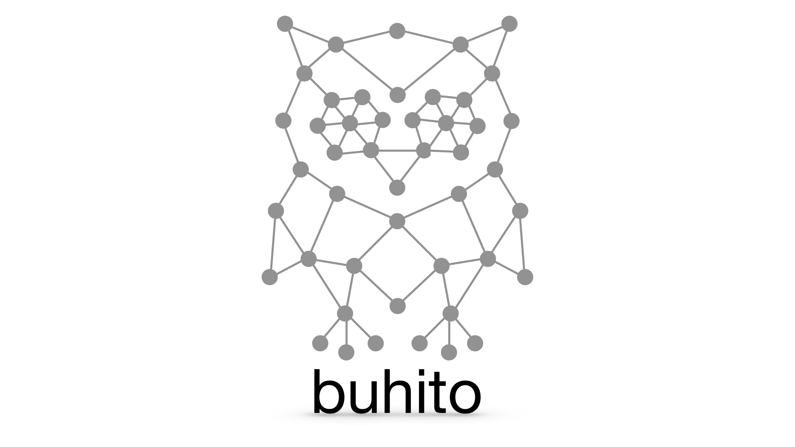

# Buhito



**Buhito learns a reusable dictionary of recurring labeled graphlets, contracts
their occurrences, and records enough boundary information to reconstruct the
original graphs exactly.**

The compressor is model-agnostic: it accepts already-loaded NetworkX graphs and
returns NetworkX graphs that can be used by linear models, graph kernels, GNNs,
databases, or custom scientific pipelines.

## Why this is useful

Buhito keeps four questions separate:

1. **Can the graph be reconstructed?** Decode and compare topology and selected
   labels exactly.
2. **Is the representation structurally smaller?** Count nodes and edges before
   and after contraction.
3. **Does it compress under an explicit code?** Charge for the motif dictionary,
   rewritten carrier, boundary ports, selectors, and model choice.
4. **Does it help a downstream task?** Measure runtime and predictive quality
   independently of the lossless archive guarantee.

That separation is the point: exact decodability does not automatically imply
positive MDL savings, faster learning, or unchanged predictions.

## Install

```bash
git clone https://github.com/Necromath/buhito.git
cd buhito
python -m pip install -e ".[tests]"
```

The base package depends only on NetworkX, NumPy, pandas, and scikit-learn.
RDKit, plotting, notebooks, and PyTorch are optional extras.

## Runnable quick start

This complete example learns one labeled triangle rule from training graphs,
applies the frozen dictionary to held-out graphs, and verifies exact recovery.

```python
import networkx as nx

from buhito.compression import (
    ExhaustiveGraphletEnumerator,
    MDLGraphCompressor,
)


def make_graph(repeats: int) -> nx.Graph:
    graph = nx.disjoint_union_all([nx.cycle_graph(3) for _ in range(repeats)])
    nx.set_node_attributes(graph, "C", "atom")
    nx.set_edge_attributes(graph, "single", "bond")
    return graph


train_graphs = [make_graph(n) for n in (3, 4, 5)]
test_graphs = [make_graph(n) for n in (6, 7)]

compressor = MDLGraphCompressor(
    graphlet_sizes=(3,),
    n_rules=1,
    min_graph_support=1,
    min_occurrences=1,
    node_label_keys="atom",
    edge_label_keys="bond",
    selector="all_eligible",
    model_choice_bits=0.0,
    min_rule_savings_bits=float("-inf"),
    enumerator=ExhaustiveGraphletEnumerator(),
    validate=True,
)
compressor.fit(train_graphs)
result = compressor.transform(test_graphs)

compressed_graphs = result.model_graphs(force_rewrite=True)
decoded_graphs = result.decoded_graphs()

assert all(
    compressed.number_of_nodes() < original.number_of_nodes()
    for original, compressed in zip(test_graphs, compressed_graphs, strict=True)
)

node_match = nx.algorithms.isomorphism.categorical_node_match("atom", None)
edge_match = nx.algorithms.isomorphism.categorical_edge_match("bond", None)
for original, decoded in zip(test_graphs, decoded_graphs, strict=True):
    assert nx.is_isomorphic(
        original,
        decoded,
        node_match=node_match,
        edge_match=edge_match,
    )

print(compressor.dictionary_frame())
print(result.per_graph)
print(result.report)
```

Run the checked-in version with:

```bash
python examples/compression_quickstart.py
```

The permissive selector and threshold above make the rewrite visible on a tiny
toy corpus. For scientific evaluation, use the default MDL-selected dictionary
or report forced-rule experiments explicitly as diagnostics.

## The strongest parts of the API

### A frozen, leakage-safe dictionary

```python
compressor.fit(train_graphs)
train_result = compressor.transform(train_graphs)
test_result = compressor.transform(test_graphs)
```

Only `fit` discovers and ranks motifs. `transform` applies the learned rules
without changing them or inspecting prediction targets.

### Exact reconstruction

```python
compressed = test_result.model_graphs()
decoded = test_result.decoded_graphs()
```

Each contracted motif retains its rule identity and canonical boundary-port
metadata. `validate=True` decodes every proposed rewrite and rejects corruption.

### Inspectable motif decisions

```python
compressor.candidate_frame()         # every scored candidate
compressor.dictionary_frame()        # selected rules
compressor.dictionary_path_frame()   # every evaluated prefix, including empty
compressor.candidate_motif_graphs()  # labeled NetworkX motif graphs
```

The empty dictionary is a valid result. Buhito exposes both the best complete
MDL model and deliberately forced prefixes for controlled scientific comparisons.

### Explicit accounting

```python
test_result.report
test_result.per_graph
test_result.selector_curve
```

Reports separate baseline bits, dictionary cost, template cost, boundary cost,
selector cost, graph coverage, structural reduction, and net savings.

### Ordinary NetworkX outputs

```python
graphs_for_model = test_result.model_graphs(force_rewrite=True)
```

No downstream learner is built into the compressor. Dataset loading, prediction
targets, and model-specific adaptation remain outside the core library.

## Architecture

| Module | Responsibility |
|---|---|
| `compression/models.py` | schemas, shared value objects, coding primitives |
| `compression/recognition.py` | candidate recognition, occurrence counting, and alignment |
| `compression/dictionary.py` | MDL costs, selectors, and dictionary decisions |
| `compression/substitution.py` | non-overlapping contraction, ports, and decoding |
| `compression/pipeline.py` | fitted orchestration, caching, and reports |

The legacy `buhito.mdl` path remains as a compatibility layer. New code should
import from `buhito.compression`.

## Input and lossless contract

The core expects undirected, simple NetworkX graphs that are already loaded.
Choose the attributes included in the reversible code:

```python
compressor = MDLGraphCompressor(
    node_label_keys=("atom", "formal_charge"),
    edge_label_keys="bond",
)
```

Buhito reconstructs:

- undirected simple topology;
- configured node attributes;
- configured edge attributes.

Graph targets, coordinates, arbitrary metadata, and unselected attributes
remain the responsibility of the surrounding dataset object. Original node IDs
are normalized and are not part of the current coding guarantee.

## Examples worth showing

| Example | What it demonstrates |
|---|---|
| [`compression_quickstart.py`](examples/compression_quickstart.py) | complete fit → transform → decode workflow |
| [`mdl_dataset_example.py`](examples/mdl_dataset_example.py) | minimal dataset-level use with a frozen dictionary |
| [`mdl_analyze_tu.py`](examples/mdl_analyze_tu.py) | candidate and dictionary diagnostics on TU data |
| [`benchmark_reddit_tokenization.py`](examples/benchmark_reddit_tokenization.py) | original-versus-tokenized graphlet timing |
| [`benchmark_gnn_pareto.py`](examples/benchmark_gnn_pareto.py) | compression–speed–quality tradeoff study |

Dataset-specific cleanup belongs in examples or `buhito.datasets`, never in the
compression functions.

## Development

```bash
python -m pytest -q
python -m ruff check src tests examples
```

The small exhaustive enumerator is intended for tests and demonstrations. The
default Buhito breadth-first enumerator is the production backend.

## Documentation

- [Compression architecture and contract](docs/compression_architecture.md)
- [Detailed research and benchmark reference](docs/full_reference.md)
- [Research workflow notes](research/README.md)

## Citation and license

Buhito is an alpha research package. Cite the associated work or repository
version used for an experiment. See [`LICENSE.txt`](LICENSE.txt) and
[`AUTHORS.md`](AUTHORS.md).
